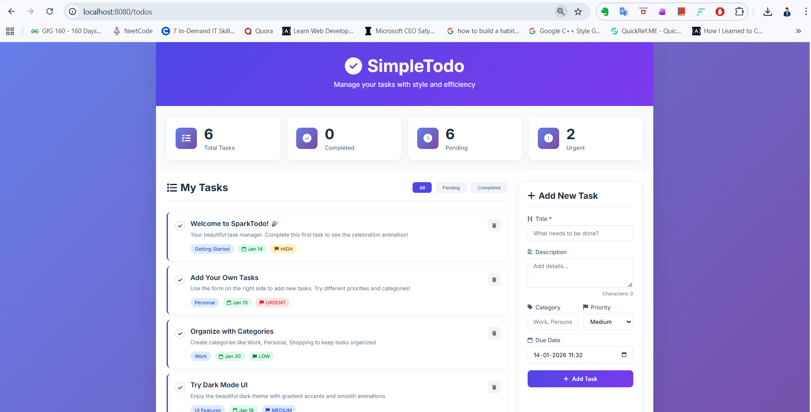
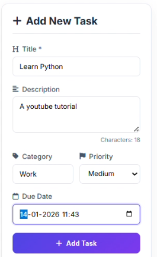
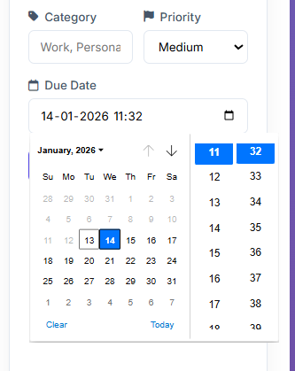
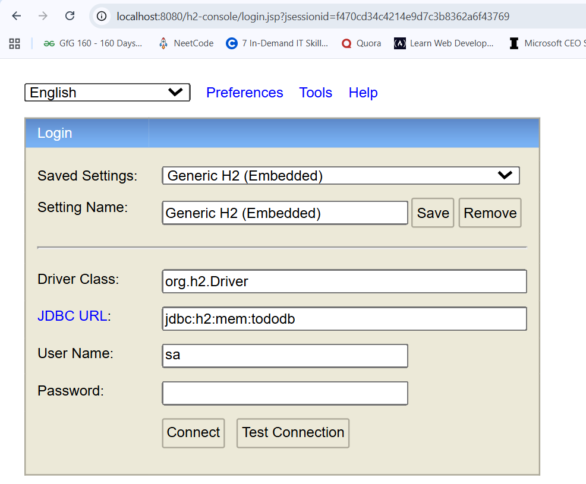
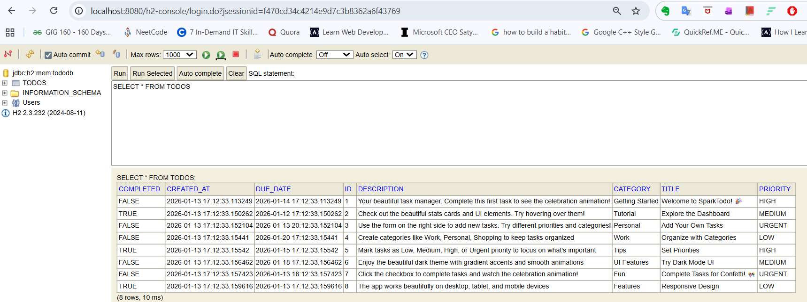

# SparkTodo


A minimal and modern Todo management application built with Spring Boot.  
The project focuses on clean UI, complete CRUD functionality, and a simple architecture suitable for learning and demonstration purposes.

---
## ▶ Watch Demo on YouTube (Click on img)

[](https://www.youtube.com/watch?v=nlq5RdOg8BA)


## Screenshots

### Dashboard


### Todo List and Task Creation


### Date and Time Picker


### H2 Database Console




---

## Features

- Create, update, delete, and complete tasks
- Task prioritization (Low, Medium, High, Urgent)
- Category-based task organization
- Due date and time support
- Real-time dashboard statistics
- Responsive layout for multiple screen sizes
- Embedded H2 database with web console
- Sample data loaded on application startup

---

## Tech Stack

### Backend
- Java 21
- Spring Boot
- Spring Data JPA
- H2 Database
- Thymeleaf
- Lombok

### Frontend
- HTML5
- CSS3
- JavaScript
- Font Awesome
- Google Fonts (Inter)

---

## Project Structure

```text
todo-app/
├── src/main/java/com/todo/todoapp/
│   ├── TodoAppApplication.java
│   ├── config/DataInitializer.java
│   ├── controller/TodoController.java
│   ├── entity/Todo.java
│   ├── repository/TodoRepository.java
│   └── service/TodoService.java
├── src/main/resources/
│   ├── static/
│   │   ├── css/style.css
│   │   └── js/script.js
│   ├── templates/index.html
│   └── application.properties
├── README.md
├── pom.xml
└── .gitignore

```

---

## Database Schema

CREATE TABLE todos (
id BIGINT PRIMARY KEY AUTO_INCREMENT,
title VARCHAR(255) NOT NULL,
description TEXT,
completed BOOLEAN DEFAULT FALSE,
created_at TIMESTAMP,
due_date TIMESTAMP,
priority VARCHAR(20),
category VARCHAR(100)
);

yaml
Copy code

---

## Getting Started

### Prerequisites

- Java 21+
- Maven 3.6+
- Git

---

### Run Locally

git clone <your-repository-url>
cd todo-app
mvn spring-boot:run

yaml
Copy code

---

## Application URLs

- Application: http://localhost:8080/todos
- H2 Console: http://localhost:8080/h2-console

### H2 Credentials

JDBC URL : jdbc:h2:mem:tododb
Username : sa
Password : (empty)

yaml
Copy code

---

## Configuration

server.port=8080

spring.datasource.url=jdbc:h2:mem:tododb
spring.datasource.driver-class-name=org.h2.Driver
spring.h2.console.enabled=true

spring.jpa.hibernate.ddl-auto=create-drop
spring.jpa.show-sql=false

spring.thymeleaf.cache=false

yaml
Copy code

---

## Sample Data

The application initializes with sample todos to demonstrate:
- Dashboard statistics
- Priority handling
- Categories
- Completed and pending tasks

---

## Troubleshooting

### Java Version
java -version

python
Copy code
Ensure Java 21 or higher.

### Port Already in Use (Windows)
netstat -ano | findstr :8080
taskkill /PID <PID> /F

yaml
Copy code

---


## License
MIT License

---

## Notes

This project is intended for learning and portfolio demonstration of:
- Spring Boot MVC
- JPA and database integration
- Server-side rendering with Thymeleaf
